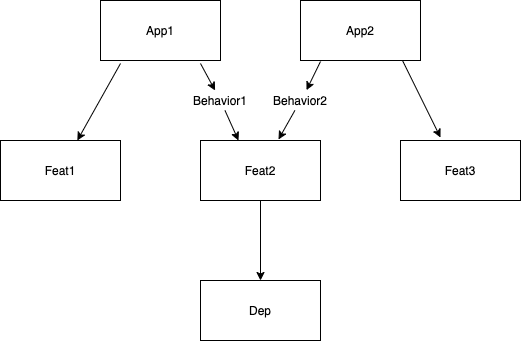

# DaggerMultiModuleExample

The intention behind this exercise was testing mutable behavior of a given dependency module.

The `app1` is composed by `feat1` and `feat2` modules and `app2` is composed by `feat2` and `feat3` modules.

`feat2` has a dependency which changes its behavior depending on the app which is using it.

## Architectural overview

For this exercise, this is the module dependency diagram:

## Tool version

Those are the versions which were used for this exercise:

- Android Studio `v.3.6.2`
- Gradle `v.5.6.4`
- Dagger `v.2.25.2`
